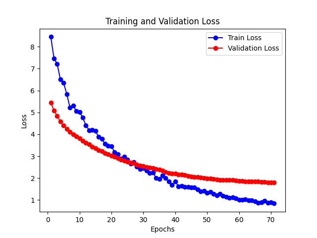

<!-- GitAds-Verify: R5KMLMR1YZLRT1F36HSCND4BGVLRLWPA -->

# Florence-2-FineTuning

 

Florence-2-FineTuning provides tools to fine‑tune Microsoft’s [Florence‑2](https://huggingface.co/collections/microsoft/florence-6669f44df0d87d9c3bfb76de) model on custom datasets. It includes scripts for dataset preparation, training and evaluation. A live demo is available on [Hugging Face Spaces](https://huggingface.co/spaces/gokaygokay/Florence-2).

## Table of Contents
- [Installation](#installation)
- [Dataset Creation](#dataset-creation)
- [Training](#training)
- [Evaluation](#evaluation)
- [Repository Structure](#repository-structure)
- [New Contributions](#new-contributions)
- [Future Work](#future-work)
- [Contributing](#contributing)
- [License](#license)

## Installation
Create a Conda environment and install the required packages:
```bash
conda create -n florence-2 python=3.10 -y && conda activate florence-2
```
Clone the repository and install dependencies:
```bash
git clone https://github.com/pecako2001/Florence-2-FineTuning.git
cd Florence-2-FineTuning
conda install pytorch torchvision torchaudio pytorch-cuda=11.8 -c pytorch -c nvidia -y
pip install packaging
pip install -r requirements.txt
```

## Dataset Creation
Use `createdataset.py` to generate the dataset files for training. Run the tool and follow the GUI prompts:
```bash
python createdataset.py
```
It assigns a unique ID to each image and stores the corresponding metadata in the `dataset/` directory. Example JSON entry:
```json
{
    "questionId": "337",
    "question": "what is the date mentioned in this letter?",
    "question_types": "['handwritten' 'form']",
    "docId": "279",
    "ucsf_document_id": "xnbl0037",
    "ucsf_document_page_no": "1",
    "answers": "['1/8/93']"
}
```
You can use [DocumentVQA](https://huggingface.co/datasets/HuggingFaceM4/DocumentVQA) as a reference dataset.

## Training
Launch training with:
```bash
python train.py --dataset_folder <path_to_dataset> --split_ratio 0.8 --batch_size 2 --num_workers 0 --epochs 2
```
Replace `<path_to_dataset>` with your dataset path. After each epoch a loss graph is saved to the repository root.
To log metrics to [Weights & Biases](https://wandb.ai), add the `--wandb` flag and install the `wandb` package.
<div align="center">
  
</div>

## Evaluation
Evaluate a trained model using `val.py`:
```bash
python val.py --task_prompt "DETAILED_CAPTION" --text_input "What do you see in this image?" --image_path <path_to_image> --model_dir <model_directory>
```
`task_prompt` selects the Florence‑2 task (e.g., `CAPTION`, `DETAILED_CAPTION`). See the Hugging Face model page for additional prompts.

## Repository Structure
The project now follows a modular layout:

- `src/florence/` – core Python modules such as dataset utilities
- `scripts/` – command line tools for training, evaluation and data preparation
- `configs/` – example configuration files
- `notebooks/` – Jupyter notebooks and demos
- `tests/` – unit tests and test stubs

## New Contributions
- Updated documentation structure for clarity.
- Added usage examples for `createdataset.py`, `train.py` and `val.py`.
- Established an extension point for future **object detection** capabilities.

## Future Work
- **Evaluation Script**: automated benchmark utilities.
- **Preprocessing Tools**: data augmentation and preprocessing.
- **Model Improvements**: advanced training techniques and optimizations.
- **Interactive Visualization**: tools for predictions and dataset inspection.
- **Documentation**: more tutorials and examples.

## Contributing
Contributions are welcome! Open an issue or pull request to suggest improvements, especially around dataset utilities or new tasks such as object detection.

## GitAds Sponsored

[](https://gitads.dev/v1/ad-track?source=pecako2001/florence-2-finetuning@github)

## License
This project is licensed under the terms of the MIT License.
